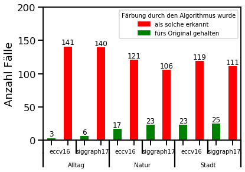

# Hinzufügen von synthetischen Farben zu schwarz weiß Bildern
###  Gruppe von Karol, Louisa, Masha
### Seminar: Visuelle Wahrnehmung beim Menschen und Bildqualität - WiSe 2020/21


### Introduction:

Heutzutage haben wir die Möglichkeit, Farben in alten Filmen oder Fotos zu reproduzieren. Das nachfolgend beschriebene Experiment wurde durchgeführt, um zu prüfen, ob Menschen Originalbilder von künstlich gefärbten Bildern unterscheiden können. 


**Fragestellung:**

Die Frage, die wir uns gestellt haben, ist folgende: 

“Können Menschen unterscheiden, ob Bildfarben original sind oder synthetisch hergestellt werden?”

 <br></br>


**Hypothese:**

Wenn die natürliche Kombination von Farben entscheidend für die Bildwahrnehmung der Menschen ist, können diese ein organisches von einem synthetisch erzeugten Bild unterscheiden.

**Methode/ Versuchsplan:**

Das Experiment wurde in 3 Phasen durchgeführt: <br>
1. Vorbereitung von Fotos:  Farbfotos wurden in Schwarz-Weiß-Fotos umgewandelt. <br>
2. Wiederherstellung der Farben: Schwarz-Weiß-Fotos wurden mit 2 Algorithmen gefärbt. (ECCV 16 und SIGGraph17) <br>
3. Bewertung: die Fotos wurden präsentiert und bewertet  <br>


**Variablen:**

Unabhängige:
* Art der Bilder 


**Abhängige**

* Farbwahrnehmung der einzelne Personen


**Art der Bilder:** 

Die Fotos sind in 3 Kategorien eingeteilt, welche verschiedene Bereiche unseres alltäglichen Lebens darstellen, die, unserer Meinung nach, einen Einfluss auf die Wahrnehmung der Farbe auf dem Foto haben könnten.

1. Stadt
2. Natur
3. Alltag


**Versuchsbedingungen:** 

Die Testperson hatte die Wahl zwischen 2 Fotos, einem Original und einem künstlich gefärbten. Das Experiment dauerte etwa 5 Minuten. 


* 2-er Vergleich:
* Originalbild vs. künstlich gefärbtes (zufällige Position)
* 5 Minuten Bearbeitungszeit


### Ergebnisse

### Sanity check/ data cleaning 


```python
import pandas as pd    # module to work with data in DataFrames.
import seaborn as sns  # module to plot DataFrames in an easy way
import matplotlib.pyplot as plt
import numpy as np
from itertools import groupby
from IPython.display import Image
from PIL import Image
import matplotlib.patches as mpatches
```


```python
sns.set_context('talk')
```


```python
#read the data
df = pd.read_csv('gesamt_results.csv',index_col=False)

#add column rightChoice
df['rightChoice']=(df['ref_position']==df['response'])

#give an ID to a person for gouping by
nrows= df.shape[0]
indeces= np.asarray([i*np.ones(60) for i in range(int(nrows/60))], dtype=np.int).reshape(nrows)
df['person']=indeces
```


```python
# explore the first entries in your data
df.head()

```


<div>
<style scoped>
    .dataframe tbody tr th:only-of-type {
        vertical-align: middle;
    }

    .dataframe tbody tr th {
        vertical-align: top;
    }

    .dataframe thead th {
        text-align: right;
    }
</style>
<table border="1" class="dataframe">
  <thead>
    <tr style="text-align: right;">
      <th></th>
      <th>category</th>
      <th>algorithmus</th>
      <th>reference_image</th>
      <th>test_image</th>
      <th>ref_position</th>
      <th>response</th>
      <th>resptime</th>
      <th>image_id</th>
      <th>rightChoice</th>
      <th>person</th>
    </tr>
  </thead>
  <tbody>
    <tr>
      <th>0</th>
      <td>Alltag</td>
      <td>siggraph17</td>
      <td>images/60.jpg</td>
      <td>images/60_siggraph17.jpg</td>
      <td>0</td>
      <td>0</td>
      <td>43.251104</td>
      <td>60</td>
      <td>True</td>
      <td>0</td>
    </tr>
    <tr>
      <th>1</th>
      <td>Stadt</td>
      <td>eccv16</td>
      <td>images/36.jpg</td>
      <td>images/36_eccv16.jpg</td>
      <td>1</td>
      <td>1</td>
      <td>2.402254</td>
      <td>36</td>
      <td>True</td>
      <td>0</td>
    </tr>
    <tr>
      <th>2</th>
      <td>Natur</td>
      <td>eccv16</td>
      <td>images/2.jpg</td>
      <td>images/2_eccv16.jpg</td>
      <td>0</td>
      <td>0</td>
      <td>3.484254</td>
      <td>2</td>
      <td>True</td>
      <td>0</td>
    </tr>
    <tr>
      <th>3</th>
      <td>Alltag</td>
      <td>eccv16</td>
      <td>images/55.jpg</td>
      <td>images/55_eccv16.jpg</td>
      <td>1</td>
      <td>1</td>
      <td>2.504276</td>
      <td>55</td>
      <td>True</td>
      <td>0</td>
    </tr>
    <tr>
      <th>4</th>
      <td>Natur</td>
      <td>eccv16</td>
      <td>images/3.jpg</td>
      <td>images/3_eccv16.jpg</td>
      <td>0</td>
      <td>0</td>
      <td>9.359400</td>
      <td>3</td>
      <td>True</td>
      <td>0</td>
    </tr>
  </tbody>
</table>
</div>


```python
#plot distribution of time needed for response
dfBox=df[['category','resptime']]
ax =dfBox.boxplot(by=['category'], figsize=(10,10))

ax.set_ylabel("Zeit, Sek.")
```


    Text(0, 0.5, 'Zeit, Sek.')


    

    


#### Kommentar zum Boxplot:
Unsere Einschätzung einer durchschnittlichen Dauer des Experimentes war ziemlich gut: die Median der Antwortzeit liegt bei allen 3 Kategorien unter 5 Sekunden pro Bild, was mit 60 Bildern pro Experimentdurchlauf ca. 5 Minuten ausmacht.
Am schnellsten konnten sich die Teilnehmenden bei der Kategorie Alltag entscheiden. Im Gegensatz dazu schien es bei den Bildern der anderen beiden Kategorien schwerer gewesen zu sein, eine Antwort zu geben.
Bei allen 3 Kategorien gibt's Ausreißer. Es entsteht die Frage: haben diese Ausreißer einen Einfluss auf die Ergebnisse der Datenauswertung? Um diese zu beantworten, führen wir alle Auswertungen für 2 Datensätze aus: einmal mit und einmal ohne Ausreißer. Wir werden im Folgenden sehen, dass diese Unterscheidung kaum einen Einfluss auf unsere Ergebnisse hatte.


```python
#divide the dataframe accordingly
dfWithoutOutliers= df.loc[df['resptime']<10.]
dfOutliers= df.loc[df['resptime']>=10.]
```


```python
# sanity checks: how many groups do we expect per categorical variable?

print('total amount of rows in complete data frame: ', df.shape[0]) 

[print('amount of unique values in column "',col,'": ',df[col].unique().size) for col in df[0:]]

print('total amount of rows in data frame without outliers: ', dfWithoutOutliers.shape[0]) 

[print('amount of unique values in column "',col,'": ',dfWithoutOutliers[col].unique().size) for col in df[0:]]
```

    total amount of rows in complete data frame:  900
    amount of unique values in column " category ":  3
    amount of unique values in column " algorithmus ":  2
    amount of unique values in column " reference_image ":  60
    amount of unique values in column " test_image ":  120
    amount of unique values in column " ref_position ":  2
    amount of unique values in column " response ":  2
    amount of unique values in column " resptime ":  899
    amount of unique values in column " image_id ":  60
    amount of unique values in column " rightChoice ":  2
    amount of unique values in column " person ":  15
    total amount of rows in data frame without outliers:  835
    amount of unique values in column " category ":  3
    amount of unique values in column " algorithmus ":  2
    amount of unique values in column " reference_image ":  60
    amount of unique values in column " test_image ":  120
    amount of unique values in column " ref_position ":  2
    amount of unique values in column " response ":  2
    amount of unique values in column " resptime ":  834
    amount of unique values in column " image_id ":  60
    amount of unique values in column " rightChoice ":  2
    amount of unique values in column " person ":  15


    [None, None, None, None, None, None, None, None, None, None]


```python
# for complete data frame we expect 20 pictures per category; 10 colored by 1 algorithm, 10 by another; each of 15 people gets such a set
agg1 = df[['category','algorithmus', 'person']].groupby(['category','algorithmus']).count()
print(agg1)

#check, whether devision of data set worked correctly
aggWithoutOut=dfWithoutOutliers[['category','algorithmus', 'person']].groupby(['category','algorithmus']).count()
print(aggWithoutOut)

aggOut=dfOutliers[['category','algorithmus', 'person']].groupby(['category','algorithmus']).count()
print(aggOut)
```

                          person
    category algorithmus        
    Alltag   eccv16          150
             siggraph17      150
    Natur    eccv16          150
             siggraph17      150
    Stadt    eccv16          150
             siggraph17      150
                          person
    category algorithmus        
    Alltag   eccv16          144
             siggraph17      146
    Natur    eccv16          138
             siggraph17      129
    Stadt    eccv16          142
             siggraph17      136
                          person
    category algorithmus        
    Alltag   eccv16            6
             siggraph17        4
    Natur    eccv16           12
             siggraph17       21
    Stadt    eccv16            8
             siggraph17       14


```python
#Check amount of right and wrong answers per person
#if too many wrong answers: mb person mixed up F and J or the task to select the ORIGINAL image
agg2 = df[['algorithmus','person','rightChoice']].groupby(['person','rightChoice']).count() #pay attention to person 4
print(agg2)
```

                        algorithmus
    person rightChoice             
    0      False                  6
           True                  54
    1      False                 15
           True                  45
    2      False                  3
           True                  57
    3      False                  4
           True                  56
    4      False                 49
           True                  11
    5      False                  6
           True                  54
    6      False                  1
           True                  59
    7      False                 10
           True                  50
    8      False                 10
           True                  50
    9      False                 12
           True                  48
    10     False                  3
           True                  57
    11     False                  8
           True                  52
    12     False                 12
           True                  48
    13     False                  4
           True                  56
    14     False                  8
           True                  52


```python
#change True and False for person 4
df.loc[df['person']==4,['rightChoice']]=( df['ref_position'] != df['response'])
#same view as before, person 4 fixed
agg2 = df[['algorithmus','person','rightChoice']].groupby(['person','rightChoice']).count() #pay attention to person 4
print(agg2)

#change True and False for person 4 in data frame without outliers
dfWithoutOutliers.loc[dfWithoutOutliers['person']==4,['rightChoice']]=( dfWithoutOutliers['ref_position'] != dfWithoutOutliers['response'])
#same view as before, person 4 fixed
aggWO = dfWithoutOutliers[['algorithmus','person','rightChoice']].groupby(['person','rightChoice']).count() #pay attention to person 4
print(aggWO)
```

                        algorithmus
    person rightChoice             
    0      False                  6
           True                  54
    1      False                 15
           True                  45
    2      False                  3
           True                  57
    3      False                  4
           True                  56
    4      False                 11
           True                  49
    5      False                  6
           True                  54
    6      False                  1
           True                  59
    7      False                 10
           True                  50
    8      False                 10
           True                  50
    9      False                 12
           True                  48
    10     False                  3
           True                  57
    11     False                  8
           True                  52
    12     False                 12
           True                  48
    13     False                  4
           True                  56
    14     False                  8
           True                  52
                        algorithmus
    person rightChoice             
    0      False                  5
           True                  52
    1      False                 15
           True                  43
    2      False                  3
           True                  57
    3      False                  4
           True                  54
    4      False                 11
           True                  46
    5      False                  6
           True                  54
    6      False                  1
           True                  53
    7      False                 10
           True                  48
    8      False                  6
           True                  46
    9      False                  8
           True                  45
    10     False                  1
           True                  51
    11     False                  5
           True                  45
    12     False                 12
           True                  46
    13     False                  2
           True                  49
    14     False                  8
           True                  49


    /home/mascha/miniconda3/lib/python3.7/site-packages/pandas/core/indexing.py:1736: SettingWithCopyWarning: 
    A value is trying to be set on a copy of a slice from a DataFrame.
    Try using .loc[row_indexer,col_indexer] = value instead
    
    See the caveats in the documentation: https://pandas.pydata.org/pandas-docs/stable/user_guide/indexing.html#returning-a-view-versus-a-copy
      isetter(loc, value[:, i].tolist())


### Visualisierung der Ergebnisse


```python
#define the first plot

def autolabel(rects, axes):
        for rect in rects:
            height = rect.get_height()
            axes.text(rect.get_x() + rect.get_width()/2., height,
                    '%d' % int(height),fontsize=12,
                    ha='center', va='bottom')

def plot1(df):
    df2 = df[['algorithmus','rightChoice','person']]
    df3=df2.groupby(['algorithmus','rightChoice']).count()
    df3 = df3.unstack(level=1)
    df3.columns = df3.columns.droplevel(level=0)
    alg=df3.index

    # set width of bars
    barWidth = 0.25

    # Set position of bar on X axis in order to get a not-stacked bar plot
    r1 = np.arange(2)
    r2 = [x + barWidth for x in r1]

    a2=plt.bar(r1, df3[False], color='green',width=barWidth)
    a1=plt.bar(r2, df3[True],color='red',width=barWidth)

    plt.ylabel('Anzahl Fälle')
    plt.xlabel('Algorithmus')
    plt.xticks([r + barWidth for r in range(2)], alg)
    legend=plt.legend([a1,a2],['als solche erkannt','fürs Original gehalten'],title="Färbung durch den Algorithmus wurde",fontsize=10, title_fontsize=10)
    axes = plt.gca()
    axes.set_ylim([0,550])
    
    #source: https://stackoverflow.com/questions/30228069/how-to-display-the-value-of-the-bar-on-each-bar-with-pyplot-barh
    
    autolabel(a2, axes)
    autolabel(a1, axes)
    plt.show()
```


```python
#create plot1 for the complete dataset
plot1(df)
```


    

    


```python
#create plot1 for the dataset without outliers
plot1(dfWithoutOutliers)
```


    

    


#### Kommentar zu Plot1:
Man bemerkt, dass siggraph17 Färbungen liefert, die zwar etwas häufiger mit der Originalfärbung verwechselt werden. Der Unterschied ist allerdings marginal. Das gilt sowohl für den Datensatz mit, als auch für den ohne Ausreißer. Das entfernen von Ausreißer verändert also nicht das Gesamtbild. 


```python
#define plot2
#partially taken over from https://www.py4u.net/discuss/153265
def plot2(df):
    def add_line(ax, xpos, ypos):
        line = plt.Line2D([xpos, xpos], [ypos + .1, ypos],
                          transform=ax.transAxes, color='black')
        line.set_clip_on(False)
        ax.add_line(line)

    def label_len(my_index,level):
        labels = my_index.get_level_values(level)
        return [(k, sum(1 for i in g)) for k,g in groupby(labels)]

    def label_group_bar_table(ax, df):
        ypos = -.1
        scale = 1./df.index.size
        for level in range(df.index.nlevels-1)[::-1]:
            pos = 0
            for label, rpos in label_len(df.index,level):
                lxpos = (pos + .5 * rpos)*scale
                ax.text(lxpos, ypos, label, ha='center', transform=ax.transAxes, fontsize=10)
                add_line(ax, pos*scale, ypos)
                pos += rpos
            add_line(ax, pos*scale , ypos)
            ypos -= .1


    dfAct = df[['category','algorithmus','rightChoice','person']]
    df3=dfAct.groupby(['category','algorithmus','rightChoice']).count()

    #set colors
    df3.loc[(slice(None),slice(None), slice(True)), 'color']='red'
    df3.loc[(slice(None),slice(None), slice(False)), 'color']='green'

    #create figure
    fig = plt.figure()
    ax = fig.add_subplot(111)
    plots=df3['person'].plot(kind='bar',ax=fig.gca(), color=df3.color) #ax= get current axes
    #Below 3 lines remove default labels
    labels = ['' for item in ax.get_xticklabels()]
    ax.set_xticklabels(labels)
    ax.set_xlabel('')

    label_group_bar_table(ax, df3)
    fig.subplots_adjust(bottom=.1*df.index.nlevels)
    plt.ylabel('Anzahl Fälle')
    red_patch = mpatches.Patch(color='red', label='als solche erkannt')
    green_patch = mpatches.Patch(color='green', label='fürs Original gehalten')
    plt.legend(handles=[red_patch, green_patch],title="Färbung durch den Algorithmus wurde",fontsize=10, title_fontsize=10)  
    ax.set_ylim([0,200])
    autolabel(ax.patches,ax)
    plt.show()
```


```python
#plot 2 for complete dataframe
plot2(df)
```


    

    


```python
#plot 2 for dataframe without outliers
plot2(dfWithoutOutliers)
```


    

    


#### Kommentar zu Plot2:
Für beide Datensätze (mit und ohne Ausreißer) gilt: 
1. siggraph17 performt konsequent besser, als eccv16, und zwar über alle Bildkategorien. Wiederum aber nicht wirklich signifikant besser.
2. Menschen können am besten originale von künstlichen Färbungen der Bilder in Kategorie Alltag unterscheiden. In den Kategorien Natur und Stadt ist es ungefähr gleich schwer.


### Diskussion
Es war im Großteil der Fälle zu beobachten, dass die Versuchspersonen einen klaren Unterschied zwischen dem originalen Bild und dem vom Algorithmus gefärbten Bild erkennen konnten. Somit kann man davon ausgehen, dass die Färbung der Bilder bei der Wahrnehmung der darauf abgebildeten Objekte eine Rolle spielt. Bei dem siggraph17 Algorithmus fiel es den Versuchspersonen im Allgemeinen leichter, das originale Bild ausfindig zu machen. Das kann damit erklärt werden, dass sowohl unsere Wahrnehmung als auch die Fortgeschrittenheit des genutzten Algorithmus eine Rolle spielt.
 
**Mögliche Probleme**

Aufgrund des Qualitätunterschiedes solcher färbenden Algorithmen, kann jedoch schwer eine allgemeine Aussage für eine vielzahl von Fällen getroffen werden. Des Weiteren haben wir mit einer Anzahl von insgesamt 15 Personen eine relativ kleine Versuchsgruppe. Außerdem könnte die Aufgabenstellung klarer formuliert werden, um Nachfragen oder falsches Ausführen des Experimentes zu vermeiden.
 
**Offene Fragen**

Es ist aufgefallen, dass es einen Unterschied für die jeweiligen Versuchspersonen ausmachte, ob sie ein Bild aus der Kategorie ‚Natur‘, ‚Stadt‘ oder ‚Alltag‘ vor sich hatten. Interessant wäre für die zukünftigen Versuche, inwiefern dies an den abgebildeten Objekten liegt, oder ob es mehr mit der Farbpalette und Farbvariation in den genutzten Bilder zusammenhängt. Außerdem könnte noch weiter untersucht werden, ob die Versuchspersonen auch das synthetisch gefärbte Bild als solches erkennen würden, wenn das Orginal nicht als Vergleichsobjekt vorliegen würde.


```python

```
